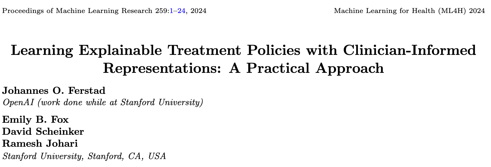
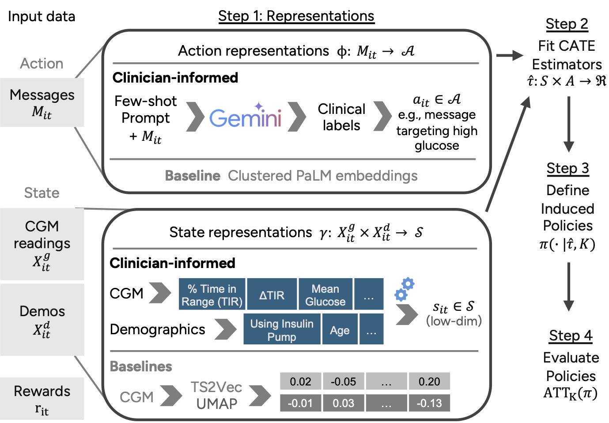

This is the supplementary code to 
**Learning Explainable Treatment Policies with Clinician-Informed Representations: A Practical Approach**, presented at Machine Learning for Health (ML4H) 2024.

This repository contains code designed to assist researchers in learning and evaluating explainable treatment policies for their respective domains.

Please note that most of the code is non-executable, as it requires access to raw data containing PHI, which we are unable to share publicly.

Researchers with experience in applied ML or data science should find it relatively straightforward to apply our code to new data.

If you have any questions about applying our approach to your research, feel free to reach out.

### Main Files

|     |  |
| -------- | ------- |
| [pretraining/gemini_feature_extraction.ipynb](pretraining/llm_feature_extraction.ipynb)  | Extracting clinician-informed features from messages sent to patients using LLM |
| [pretraining/text_embeddings.ipynb](pretraining/text_embeddings.ipynb)  | Extracting raw features from message text using LLM embeddings |
| [pretraining/ts2vec_state_reps.ipynb](pretraining/ts2vec_state_reps.ipynb)  | Learning features from raw CGM time series data with TS2Vec |
| [pretraining/umap_state_reps.ipynb](pretraining/umap_state_reps.ipynb)  | Learning features from raw CGM time series data with UMAP |
| [pretraining/action_reps.ipynb](pretraining/action_reps.ipynb)  | Learning discrete features from LLM embeddings with clustering |
| [interpreting_state_action_reps.ipynb](interpreting_state_action_reps.ipynb)  | Looking at properties of, and relationships between, state and action representations |
| [cate_estimation_policy_eval.ipynb](cate_estimation_policy_eval.ipynb)  | Training Conditional Average Treatment Effect (CATE) Estimators and evaluating the treatment targeting policies they induce |
| [plotting_eval_results.ipynb](plotting_eval_results.ipynb)  | Plotting policy evaluaton results generated in `cate_estimation_policy_eval.ipynb` |
| [policy_interpretation_clinical_reps.ipynb](policy_interpretation_clinical_reps.ipynb)  | Trains and interprets a treatment targeting policy induced by a CATE estimator trained on clinician-informed representations |
| [policy_interpretation_raw_reps.ipynb](policy_interpretation_raw_reps.ipynb)  | Trains and interprets a treatment targeting policy induced by a CATE estimator trained on 'black-box' representations learned directly from raw data |

